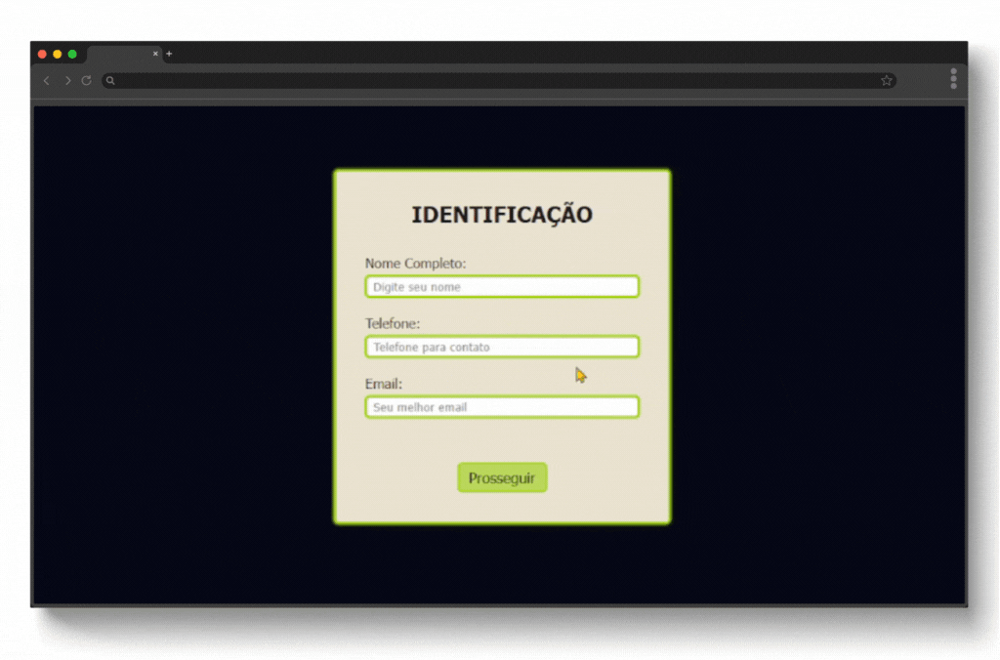

# Book and Cut
A scheduling system for a barbershop.  Created for academic purposes only, this project serves as a portfolio to demonstrate skills in HTML5 and CSS3.

## ⚙️ Tecnologias Utilizadas

<div align="center">
    
    
    
</div><br>

<div align="center">
    
</div>

## 📁 Guia do Projeto

```bash
book-and-cut/
├── docs/
│   └── demo.gif
├── css/
│   ├── global.css
│   └── style.css
├── imgs/
├── index.html   #root
├── confirmacao.html
├── servicos.html
├── agendamento.html
├── LICENSE
└── README.md
```
